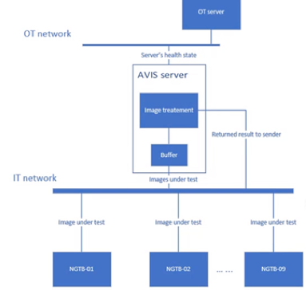

# Server Connections and Specifications

 

| Product | AVIS Appliance |
| :--- | :--- |
| **Form Factor** | 1U server   CE Marking |
| **Processor** | Intel Xeon E-2288G |
| **# of Cores** | 8 |
| **Memory** | 16GB DDR4 |
| **Storage** | 2x 1TB HDD 3.5" (RAID 1) |
| **Connectivity** | Quad 1GB Ethernet Ports  iDRAC9 Enterprise |
| **Power Supply** | Dual Redundant 550W |
| **Mounting** | Sliding Rails |
| **Operating System** | Ubuntu 18.04.5 |
