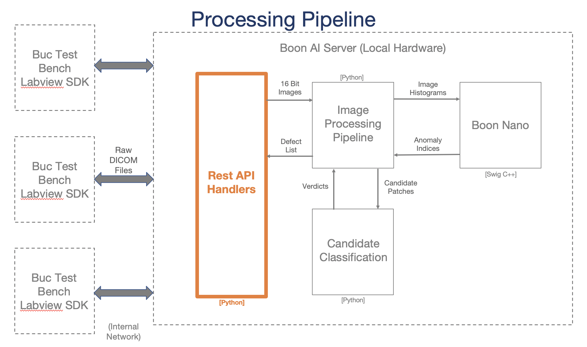
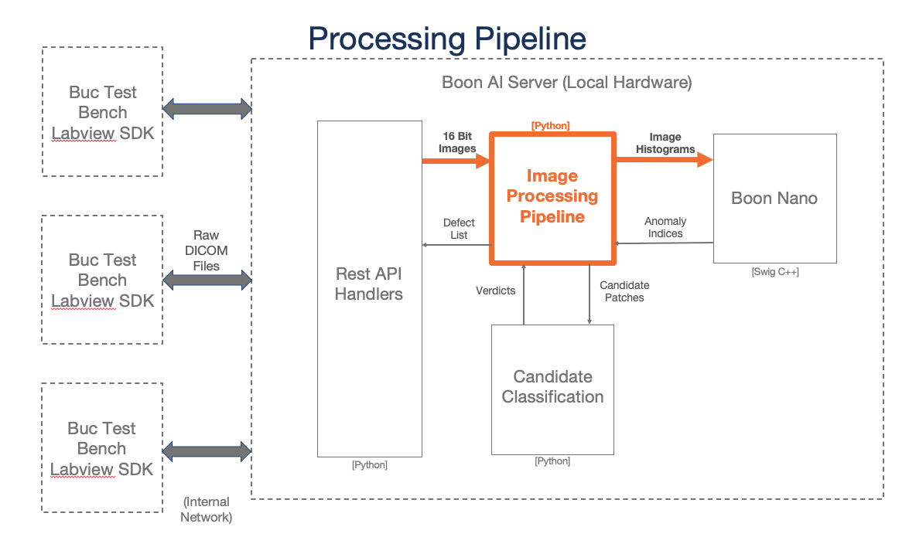
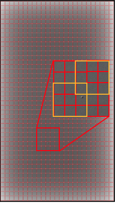
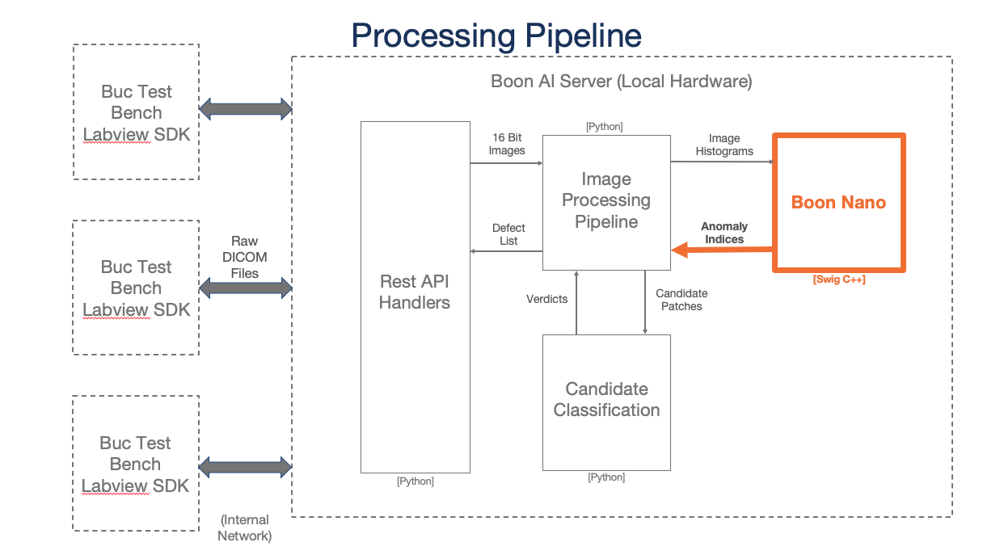
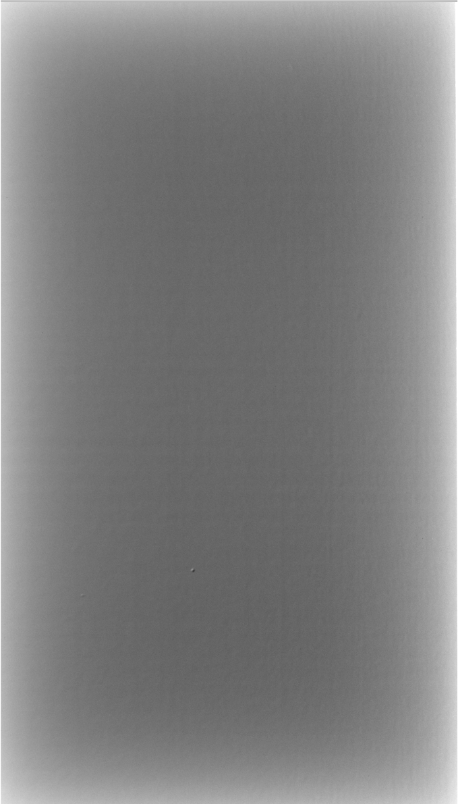
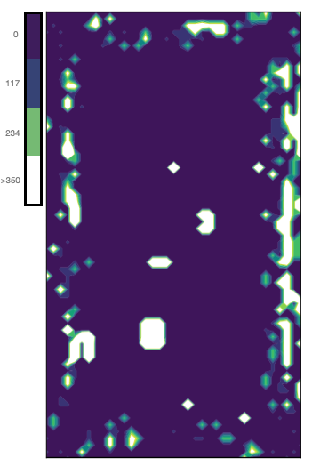
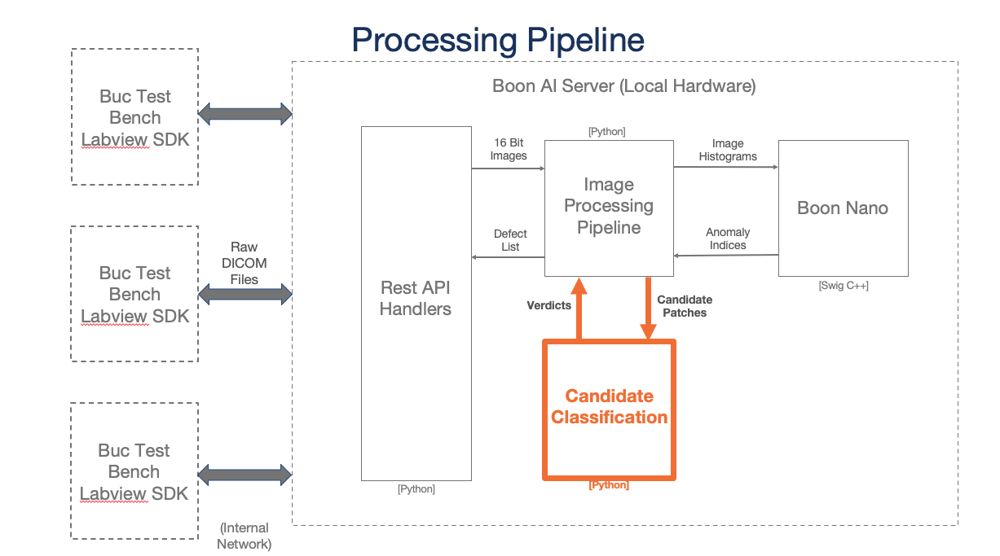
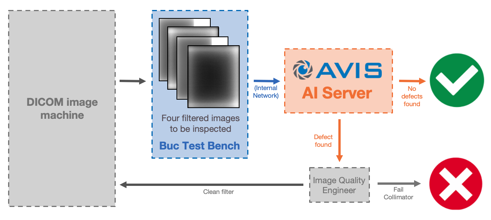

# System Architecture

This server is made to process DICOM test images and return major and minor defect information to the user.

## Labview SDK

Located on the test bench controller, this interfaces with the AVIS server over the internal network.  

  

 
 

**Example image**

## AVIS AI Server

On-prem 1U mountable rack to be delivered on site.

 
 

**Specifications:**   
* Manufacturer&emsp;&emsp;&emsp;&emsp;&emsp;&emsp;Dell
* Device&emsp;&emsp;&emsp;&emsp;&emsp;&emsp;&emsp;&emsp;&emsp;R240
* CPU&emsp;&emsp;&emsp;&emsp;&emsp;&emsp;&emsp;&emsp;&emsp;&emsp;Intel Xeon E-2288G (16 Threads)
* Memory&emsp;&emsp;&emsp;&emsp;&emsp;&emsp;&emsp;&emsp; 16 GB
* Connectivity &emsp;&emsp;&emsp;&emsp;&emsp;&emsp; Dual 1-Gb Ethernet Link
* Test Benches Supported&emsp;10

**Features:**  
* On-Premise AI Inference and Training
* Up to 10 simultaneous Image Analysis Pipelines
* Boon Logic API Server
* Token Authentication
* RSA Authentication for SSH Access
* iDRAC Server Monitoring
* Boon OTA Software Update
* Simple Disaster Recovery

### See the [Server Connections Document](./server_connections.md) for more information.

## REST API

REST interface for accessing the server and its processed results.

 
 

| General |  |
| :--- | :--- |
| **Status** | Timestamp of the call to determine if server is active  |
| **Version** | Version numbers for all included software |

**Included Software:**
* avis-dicom-api
* avis-dicom-common
* builder
* expert-common
* nano-py-bindings
* nano-secure

| Test Bench | |
| :--- | :--- |
| **Attach** *(Required)* | Assign identifier |
| **Detach** | Remove identifier from the list of valid test benches |
| **Status** | Status in pipeline of individual test bench   **OR**   List of all test benches' statuses in their respective pipelines |

| Parameters |  |
| :--- | :--- |
| **Define** | Set values and forego autotuning for any set values |
| **Returned** | Complete list of parameters used in processing of the image (including auto-set values)

##### subcell
###### width (configurable) - number of pixels across for the subimage
###### shift (set) - number of pixels to shift over between each subimage
##### preprocess
###### filter (configurable) - filter to preprocess the whole image. Options are median, gaussian, or none
###### parameter (configurable) - parameter associated with the filter. If the filter is median, this value corresponds to the window width, if the filter is gaussian, then this corresponds to the sigma value
##### edge (configurable) - number of pixels to trim around the edge of the image
##### thresholds
###### contrast (configurable) - defect contrast threshold for determining whether the candidate is minor or major
###### variation (set) - the distance measurement to distinguish variation between subimages (Boon value)
###### distance (set) - distance index between subimages' clusters (Boon value)
###### local z value (set) - statistical normality value measuring the variation of pixel values within the subimage (Boon value)
##### histogram maximum (set) - value for cropping histogram of magnitude values for each subimage

| Image |  |
| :--- | :--- |
| **Send** *(Required)* | Send DICOM image to AVIS server to be processed |

| Results |  |
| :--- | :--- |
| **Returned** *(Required)* | Summary of defect values resulting from the last image processed |

##### image - identifier associated with the last image processed
##### major - number of major candidates found
##### minor - number of minor candidates found
##### coordinates
###### major - list of coordinates where each major defect candidate was located on the original image

| Summary |  |
| :--- | :--- |
| **Returned** *(Required)* | Send DICOM image to AVIS server to be processed |

**Example summary file**  
 

### See the [API Documentation](./api_docs.md) for more information.

## Image Process

General pipeline happening on the backend when each DICOM image is pushed to the AVIS server.

 
 

#### Step 1: Crop SF images
Using the image name identifier, the right edge is clipped if the DICOM image name contains the filter identifier "SF". If the filter is LF, this step is skipped.
#### Step 2: Filter image
Using the specified filter type in the configuration (gaussian, median, or none), the image is passed through the filter. The filtered image is now the image used in the rest of the processing pipeline.
#### Step 3: Subdivide image
Using the subcell width from the configuration (in number of pixels), the DICOM image is subdivided into smaller images. The number of pixels between each subimage is the subcell shift value in the configuration. 
  
Subimages are shown in yellow. This simplified example is for a width of 3 and a shift of 2.
#### Step 4: Convert subimages to histograms of magnitudes
Each subimage is converted to a histogram of magnitudes using the raw pixel values. Pixel values are binned so that the histogram is has 64 bins of pixels. These histograms are what are used to create the model for each image and find any defects.

## Clustering Process

Boon Logic clustering process of the DICOM image.

 
 

The histograms for the image are clustered using Boon Logic's nano clustering technique. From the raw image, shown on the right, the resulting clusters are assigned frequency values where high values are associated with areas of the image that are different from the rest of the image regions. The image shown on the right is a contour plot of an example DICOM image's results with areas in white depicting parts of the image that are potential defects.  

  

Note that areas along the edge of the image are white where the original image has a natural gradient. This will be taken into account and ignored in the classification step if those areas are indeed just gradients.

## Classification Process

Process for classifying the candidates as major or minor defects.

 
 

### Major candidates - values fall above ALL thresholds
### Minor candidates - values fall above SOME thresholds

### Factors
#### Contrast
1. Fits each candidate subimage to a plane  
2. Find the difference between the min pixel value and the expected plane value (as well as the difference between the max and the plane)
3. Difference value divided by the expected plane value gives the contrast measurement
4. Contrast value is compared to the threshold value (defaulted to 0.02)

#### Distance
1. Cluster distance from other clusters created throughout the image
2. 95th percentile of all distance indexes within the image is the threshold
3. Compare candidate distance index against threshold

#### Local Z value
1. Finds the overall mean and standard deviation of the image's pixel values.
2. Find the candidates' z value for the min (and max) local pixel value
3. Compare z values against the average z value throughout the whole image

# Deliverables

### * 1U rack-mountable server (see [AVIS DICOM Server](#avis-ai-server) section)
### * Results values
- Major candidate count
- Minor candidate count
- Coordinates of major candidates
- Summary image of the locations of the candidates and the window level/window width used for displaying the image

# AVIS Enabled Process

 
 
