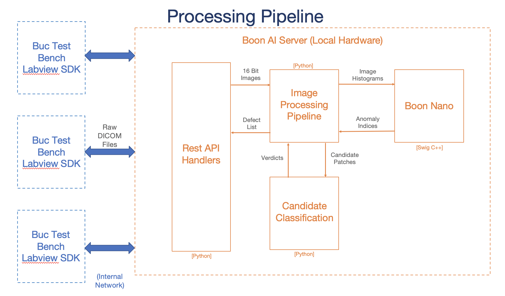
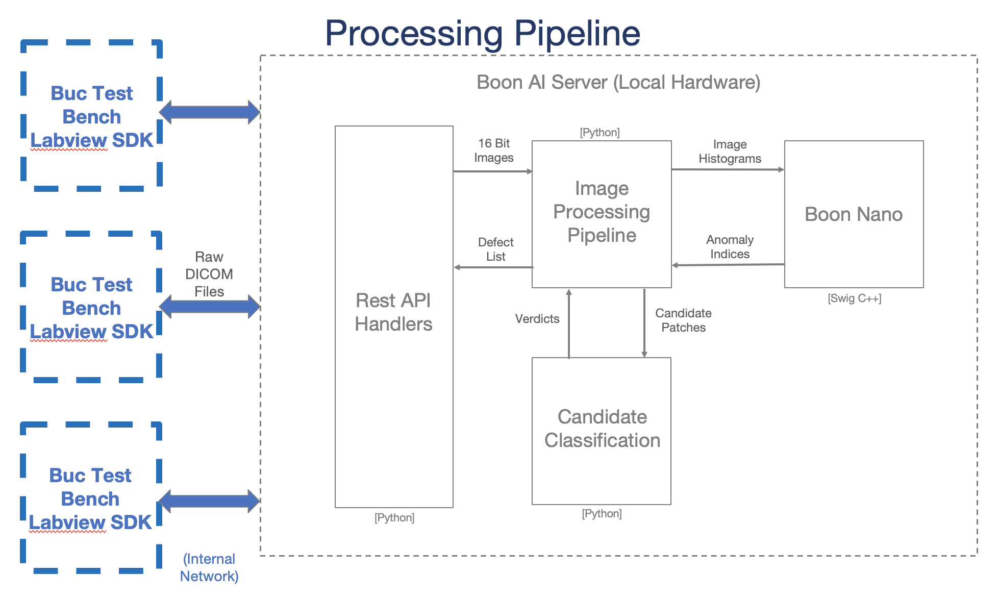
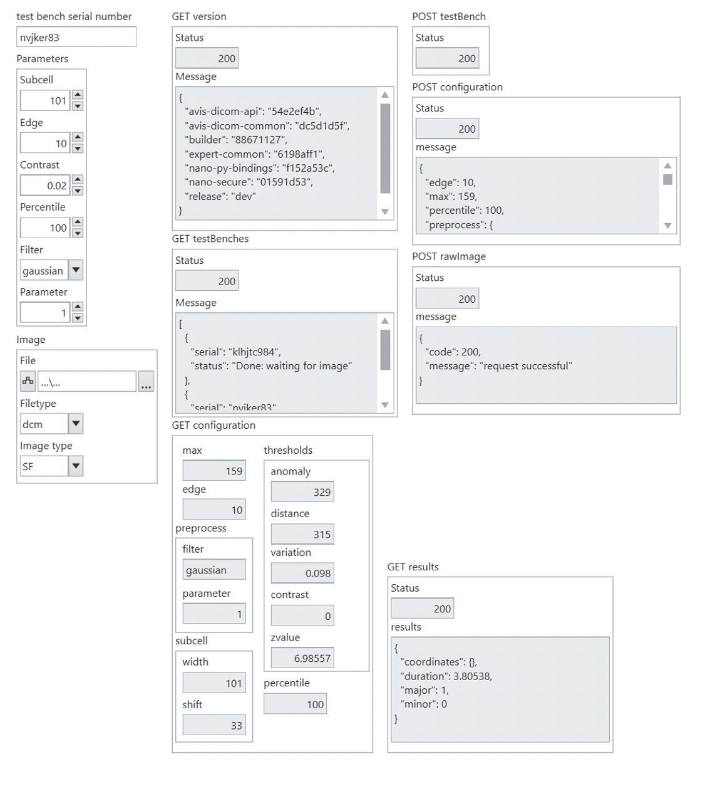
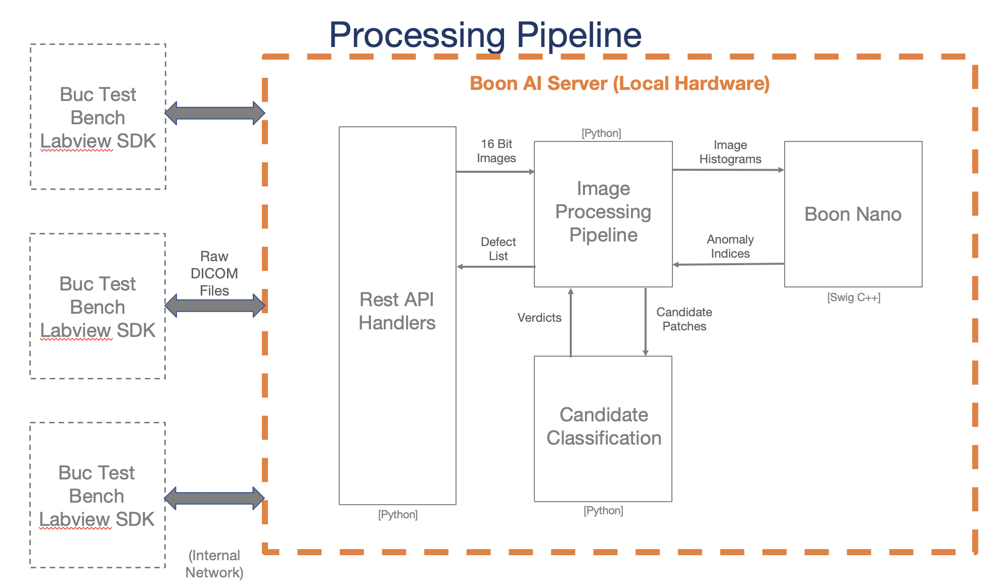

# System Architecture

This server is made to process DICOM test images and return major and minor defect information to the user.

## Labview SDK

Located on the test bench controller, this interfaces with the AVIS server over the internal network.  

  

 
 

**Example image**

## AVIS AI Server

On-prem 1U mountable rack to be delivered on site.

 
 

**Specifications:**   
* Manufacturer&emsp;&emsp;&emsp;&emsp;&emsp;&emsp;Dell
* Device&emsp;&emsp;&emsp;&emsp;&emsp;&emsp;&emsp;&emsp;&emsp;R240
* CPU&emsp;&emsp;&emsp;&emsp;&emsp;&emsp;&emsp;&emsp;&emsp;&emsp;Intel Xeon E-2288G (16 Threads)
* Memory&emsp;&emsp;&emsp;&emsp;&emsp;&emsp;&emsp;&emsp; 16 GB
* Connectivity &emsp;&emsp;&emsp;&emsp;&emsp;&emsp; Dual 1-Gb Ethernet Link
* Test Benches Supported&emsp;10

**Features:**  
* On-Premise AI Inference and Training
* Up to 10 simultaneous Image Analysis Pipelines
* Boon Logic API Server
* Token Authentication
* RSA Authentication for SSH Access
* iDRAC Server Monitoring
* Boon OTA Software Update
* Simple Disaster Recovery

See the [Server Connections Document](./server_connections.md) for more information.

## REST API
