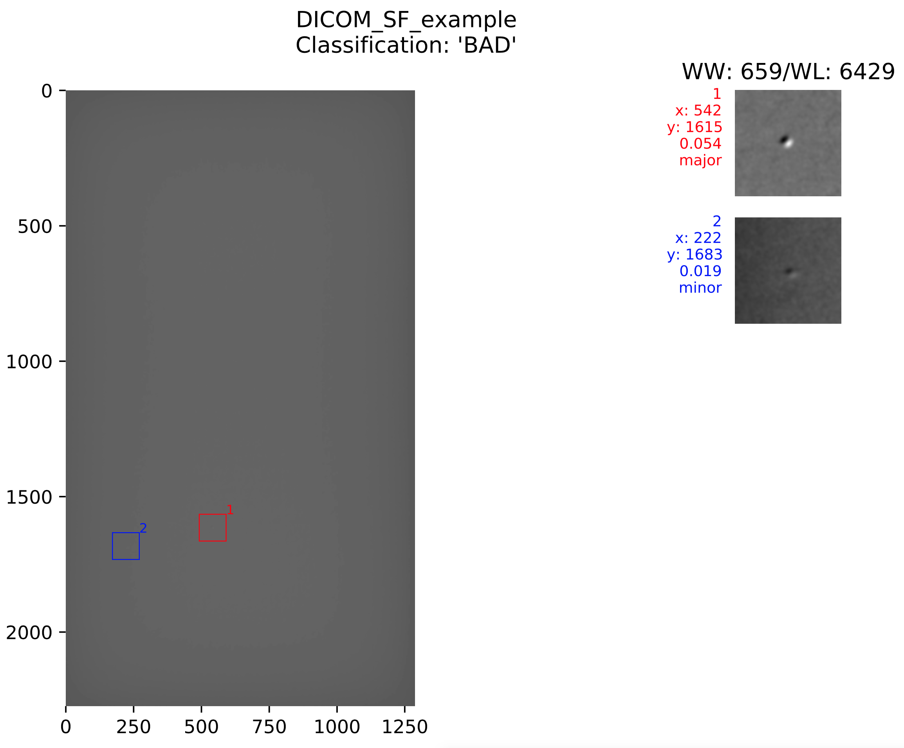

[](http://docs.boonlogic.com)

# Curl Command Walkthroughs

[* Check Connection](#example-1-check-connection)  
[* Quick Start](#example-2-quick-start)  
[* Complete Guide](#example-3-complete-guide)  

## Example 1 - Check Connection
Simple curl command to return the current timestamp. Returns the timestamp as a string if server is running (and 200 return code) and fails if server is offline.
```curl
curl -X GET http://10.0.1.41:8080/avis-dicom/v1/status
```
Returns:
```json
"24/02/2021 18:58:44"
```


## Example 2 - Quick Start

### Step 1: Connect test bench to server
Example uses identifier "test123"
```curl
curl -X POST http://10.0.1.41:8080/avis-dicom/v1/testBench/test123 \
  -H "x-token: test"
```
Returns:
```json
{
  "identifier": "test123",
  "status": "Done: waiting for image"
}
```

### Step 2: Push DICOM image through pipeline
Use any DICOM image or this [example image](../files/BAD_FilterRhAg_SF.DCM)
```curl
curl -X POST http://10.0.1.41:8080/avis-dicom/v1/rawImage/test123?filetype=dcm \
  -H "x-token: test" \
  -H "accept: application/json" \
  -H "Content-Type: multipart/form-data" \
  -F "upfile=@/path/to/image/BAD_FilterRhAg_SF.DCM"
```

Returns:
```json
{
  "code": 200,
  "message": "request successful"
}
```

### Step 3: Get results
```curl
curl -X GET http://10.0.1.41:8080/avis-dicom/v1/results/test123 \
  -H "x-token: test"
```
Returns:
```json
{
  "coordinates": {
    "major": [
      [
        704,
        150
      ]
    ]
  },
  "image": "BAD_FilterRhAg_SF",
  "major": 1,
  "minor": 0
}
```

### Step 4: Repeat steps 2 and 3 as much as desired for testing

### Step 5: Disconnect test bench
```curl
curl -X DELETE http://10.0.1.41:8080/avis-dicom/v1/testBench/test123 \
  -H "x-token: test"
```
Returns:
```json
{
  "code": 200,
  "message": "test bench was successfully disconnected"
}
```
### All steps
```curl
curl -X POST http://10.0.1.41:8080/avis-dicom/v1/testBench/test123 \
  -H "x-token: test"

curl -X POST http://10.0.1.41:8080/avis-dicom/v1/rawImage/test123?filetype=dcm \
  -H "x-token: test" \
  -H "accept: application/json" \
  -H "Content-Type: multipart/form-data" \
  -F "upfile=@/path/to/image/BAD_FilterRhAg_SF.DCM"

curl -X GET http://10.0.1.41:8080/avis-dicom/v1/results/test123 \
  -H "x-token: test"

curl -X DELETE http://10.0.1.41:8080/avis-dicom/v1/testBench/test123 \
  -H "x-token: test"
```

## Example 3 - Complete Guide

### Step 1: Check connection
```curl
curl -X GET http://10.0.1.41:8080/avis-dicom/v1/status
```
Returns:
```json
"24/02/2021 18:58:44"
```
### Step 2: Get Versioning
```curl
curl -X GET http://10.0.1.41:8080/avis-dicom/v1/version
```
Returns:
```json
{
    "avis-dicom-api": "23464844",
    "avis-dicom-common": "5e8dc6ab",
    "builder": "365b8f9b",
    "expert-common": "623013a5",
    "nano-py-bindings": "737051d3",
    "nano-secure": "01db820e",
    "nano-sgx": "e7172595",
    "release": "v2.4.1"
}
```
### Step 3: Connect Test Bench
Example uses identifier "test123"
```curl
curl -X POST http://10.0.1.41:8080/avis-dicom/v1/testBench/test123 \
  -H "x-token: test"
```
Returns:
```json
{
  "identifier": "test",
  "status": "Done: waiting for image"
}
```
Duplicate test bench identifiers are not allowed


### Step 4: List Test Benches and Their Statuses
```curl
curl -X GET http://10.0.1.41:8080/avis-dicom/v1/testBenches \
  -H "x-token: test"
```
Returns:
```json
[
  {
    "identifier": "test123",
    "status": "Done: waiting for image"
  }
]
```

### Step 5: Configure Parameters
See the [parameters explanation section](./system_architecture.md#subcell) for more information
```curl
curl -X POST http://10.0.1.41:8080/avis-dicom/v1/configuration/test123 \
    ?kernelSize=101 \
    &edgeCrop=10 \
    &filterType=gaussian \
    &filterParam=1 \
    &c0=0.02
  -H "x-token: test"
```
Returns:
```json
{
  "image": "",
  "max": 4,
  "preprocess": {
    "filter": "none"
  },
  "roseConstants": {
    "a0LF": 9,
    "a0SF": 11,
    "c0": 0.015,
    "k0": 2.0,
    "w": 2.1
  },
  "subcell": {
    "shift": 33,
    "width": 101
  },
  "thresholds": {
    "anomaly": 0,
    "distance": 0,
    "major": 0.9,
    "minor": 0.5,
    "variation": 0.0
  }
}
```

### Step 6: Process DICOM Image
Use any DICOM image or this [example image](../files/BAD_FilterRhAg_SF.DCM)
```curl
curl -X POST http://10.0.1.41:8080/avis-dicom/v1/rawImage/test123 \
    ?filetype=dcm \
  -H "x-token: test" \
  -H "accept: application/json" \
  -H "Content-Type: multipart/form-data" \
  -F "upfile=@/path/to/image/BAD_FilterRhAg_SF.DCM"
```
Returns:
```json
{
  "code": 200,
  "message": "request successful"
}
```

### Step 7: Get Pipeline Status
```curl
curl -X GET http://10.0.1.41:8080/avis-dicom/v1/testBench/test123 \
  -H "x-token: test"
```
Returns:
```json
{
  "identifier": "test",
  "status": "Done: results available for image BAD_FilterRhAg_SF"
}
```

### Step 8: Get Final Configuration Parameters
```curl
curl -X GET http://10.0.1.41:8080/avis-dicom/v1/configuration/test123 \
  -H "x-token: test"
```
Returns:
```json
{
  "image": "BAD_FilterRhAg_SF",
  "max": 4,
  "preprocess": {
    "filter": "none"
  },
  "roseConstants": {
    "a0LF": 9,
    "a0SF": 11,
    "c0": 0.015,
    "k0": 2.0,
    "w": 2.1
  },
  "subcell": {
    "shift": 33,
    "width": 101
  },
  "thresholds": {
    "anomaly": 626,
    "distance": 475,
    "major": 0.9,
    "minor": 0.5,
    "variation": 0.036
  }
}
```

### Step 9: Get Image Results
```curl
curl -X GET http://10.0.1.41:8080/avis-dicom/v1/results/test123 \
  -H "x-token: test"
```
Returns:
```json
{
  "areas": {
  	"major": [
      17
    ]
  },
  "contrasts": {
  	"major": [
      0.019
    ]
  },
  "coordinates": {
  	"major": [
      [
        1943,
        1930
      ]
    ]
  },
  "image": "BAD_FilterRhAg_SF",
  "major": 1,
  "minor": 17
}
```

### Step 10: Get Summary PDF
```curl
curl url --output ~/Desktop/test.pdf -X GET http://10.0.1.41:8080/avis-dicom/v1/summary/test123 \
  -H "x-token: test"
```
Returns:  


### Step 11: Repeat steps 6-10 as desired

### Step 12: Disconnect Test Bench from Server
```curl
curl -X DELETE http://10.0.1.41:8080/avis-dicom/v1/testBench/test123 \
  -H "x-token: test"
```
Returns:
```json
{
  "code": 200,
  "message": "test bench was successfully disconnected"
}
```
